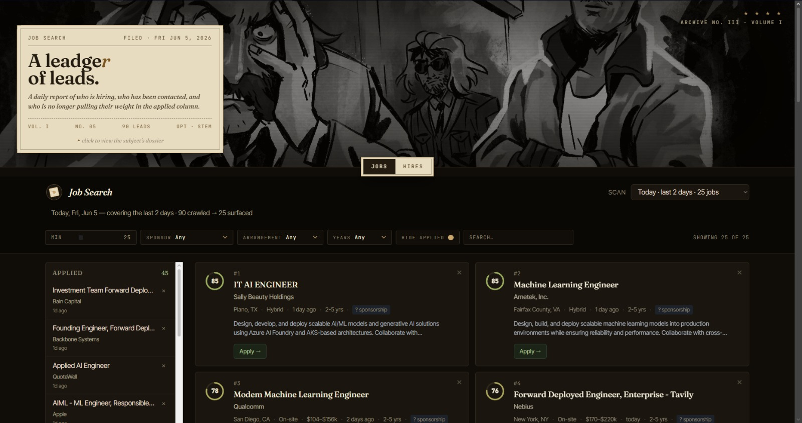

# skill-check-JobSearch

*A job-hunting rig you drive from [Claude Code](https://docs.claude.com/en/docs/agents-and-tools/claude-code/overview): find roles, find the humans hiring for them, and auto-fill applications — all scored against your own profile, rendered in a Disco-Elysium dashboard.*

`/job-search` &nbsp;·&nbsp; `/hire-search` &nbsp;·&nbsp; `/apply`



> *"There is a particular cruelty in a job board that returns nothing on a Thursday."*

Three slash commands run inside Claude Code. Each reads your profile, fans out across free sources, scores results 0–100, and appends a session to a static HTML dashboard you open in a browser. The HTML never changes between runs — only the underlying `data.js` / `hires.js` grow.

| Command | What it finds | Cost |
|---|---|---|
| **`/job-search [Nd]`** | AI/ML/LLM/founding/forward-deployed **roles** posted in the last N days | **$0** (local crawler) |
| **`/hire-search [N]`** | the **people** who hire for those roles — recruiters, HR, hiring managers, founders — with a **verified email** for each | **$0** (Brave free tier) |
| **`/apply [N]`** | auto-fills + submits applications on supported ATS (Ashby/Greenhouse/Lever/…) via your browser | **$0** |

---

## One-time setup

### 1. Prerequisites

| Tool | Install | Why |
|---|---|---|
| Python 3.10+ | — | crawler + scoring + verification scripts |
| Claude Code | [quickstart](https://docs.claude.com/en/docs/agents-and-tools/claude-code/quickstart) | runs the slash commands |
| Python deps | `pip install -U python-jobspy dnspython requests` | JobSpy = job crawler; dnspython + requests = hire-search email verify |
| Brave Search API key *(for `/hire-search`)* | free at [api.search.brave.com](https://api.search.brave.com/app/keys) — "Data for Search" free tier, 2,000 queries/mo, **no credit card** | finds hiring-team people |
| Claude-in-Chrome extension *(for `/apply`)* | [install](https://docs.claude.com/en/docs/agents-and-tools/claude-code/overview) | drives the browser to fill forms |

### 2. Clone

```bash
git clone https://github.com/<you>/skill-check-JobSearch.git
cd skill-check-JobSearch
pip install -U python-jobspy dnspython requests
```

### 3. Drop in your profile — **this is what everything scores against**

Put your materials under `profile/`. The agent reads them once at bootstrap and defers to them for every factual claim (metrics, dates, projects). Recommended:

| File | What it is |
|---|---|
| `profile/RESUME.pdf` | your current resume (also the PDF `/apply` uploads) |
| `profile/PORTFOLIO.pdf` | public-facing portfolio (optional) |
| `profile/<CURRENT_ROLE>.md` | deep-dive on your current job — what you ship, stack, scope, user/metric milestones |
| `profile/<PRIOR_ROLE>.md` | interview-grade deep-dives on prior roles |
| `profile/<PROJECT>.md` | any side project you want surfaced when scoring |
| `PRANAV_MASTER_REFERENCE.md` → rename to your own | **the source of truth** for all experience/metrics. Keep it at the repo root (or wherever `CLAUDE.md` points). Every bullet the agent writes must trace back to this file. |

> **Master reference vs. profile:** `profile/*` are inputs the crawler scores against; the **master reference** is the canonical fact sheet the agent is forbidden to contradict or fabricate beyond. Edit `CLAUDE.md` if you store it somewhere other than the repo root.

### 4. Brave key (for `/hire-search`)

Create a free key at [api.search.brave.com/app/keys](https://api.search.brave.com/app/keys), then save it **outside the repo**:

```bash
# option A — a file the scripts read automatically
echo "YOUR_BRAVE_KEY" > ~/.job_search/brave_key.txt      # Windows: C:\Users\<you>\.job_search\brave_key.txt

# option B — an environment variable
setx BRAVE_API_KEY "YOUR_BRAVE_KEY"                        # Windows
export BRAVE_API_KEY="YOUR_BRAVE_KEY"                      # macOS/Linux
```

Outbound port 25 must be open for SMTP email verification (it is on most home/office networks; if your ISP blocks it, hire-search still returns candidate email lists, just fewer *confirmed* ones).

### 5. Answers file (for `/apply`)

Copy the schema template and fill in your details — it stays **outside the repo** (it has your address, phone, work-auth, EEO answers):

```bash
cp scripts/answers.example.json ~/.job_search/answers.json
# then edit ~/.job_search/answers.json — name, contact, location, work authorization,
# compensation, work history, links, and typical_short_answers (elevator pitch, "anything else", etc.)
```

Cover-letter PDFs live in `scripts/covers/` (`_AI` / `_ML` / `_FullStack`); replace them with your own. `/apply` attaches the right one by role, only when it helps.

### 6. Bootstrap state

The first `/job-search` walks you through a short questionnaire (salary floor/target, location, in-scope titles, dealbreakers) and creates your personal state **outside the repo**:

```
~/.job_search/state.json          source of truth — never committed
~/.job_search/sessions/           per-run archives
~/.job_search/raw_jobs/           raw crawl JSON
```

Everything in this repo is *code + templates*; all personal data lives under `~/.job_search/`.

---

## Daily use

Once set up, it's just three commands inside Claude Code:

```
# ROLES
/job-search                 past 24h
/job-search 7d              past week
/job-search 14d             past two weeks
/job-search show me jobs from Cohere       targeted single-company crawl
/job-search I applied to Anthropic         mark as applied (no crawl)
/job-search reset job history              destructive — confirms first

# PEOPLE (reuses your latest /job-search crawl — walks top jobs, finds who hires)
/hire-search                top 50 jobs → recruiters/HR/founders + verified emails
/hire-search 20             target 20 jobs-with-contacts
/hire-search dry-run 10     preview, write nothing

# APPLY (auto-fills supported-ATS applications in your browser)
/apply dry-run 5            preview the 5 targets it would apply to
/apply 5                    apply to the top 5 (highest-scoring, supported ATS)
/apply 5 min-score=30       lower the score floor
```

After any run, open the dashboard in a browser:

- **`jobs_ui/index.html`** — roles (Applied / Dismissed sidebar, per-session dropdown)
- **`jobs_ui/hires.html`** — people (verified emails get a green ✓ badge; unconfirmed ones show a "try these" candidate list as mailto links)

Filters and Applied/Contacted/Dismissed state persist in `localStorage`.

---

## How each command works (short)

**`/job-search`** fuses four free sources into one normalised feed — [JobSpy](https://github.com/speedyapply/JobSpy) (Indeed/Google/Glassdoor/LinkedIn), [`SimplifyJobs/New-Grad-Positions`](https://github.com/SimplifyJobs/New-Grad-Positions), [`speedyapply/2026-AI-College-Jobs`](https://github.com/speedyapply/2026-AI-College-Jobs), and [Arbeitnow](https://www.arbeitnow.com/api/job-board-api) — then resolves aggregator URLs to **direct ATS/company links** (via each company's public job-board API), drops stale/senior/no-sponsorship/defense roles, dedups, scores, and writes `data.js`.

**`/hire-search`** reuses your latest job-search crawl. For each top-scoring job it uses only the metadata (company/role/team/location) to find who hires there — **recruiter → head of people/HR → hiring manager → founder → engineer (last resort)** — via the Brave Search API. It recovers a real email per person (GitHub commit email, or name+domain permutation graded by a **single-connection SMTP probe**: `verified | catch-all | unverified`), and only presents **confirmed** emails as answers; the rest come with a ranked candidate list to try. Writes `hires.js`.

**`/apply`** picks the top supported-ATS targets from your latest job-search session and delegates each to a browser sub-agent that fills required fields correctly, treats optionals as opt-in, attaches a cover letter only when it helps, writes free-text answers in your voice (grounded in `answers.json` + your master reference), never solves CAPTCHAs, and never fills sensitive fields. Records every outcome to `state.json`.

> **Everything runs off free tiers and local compute.** No paid subscriptions. The old Apify path is retired.

---

## Customize for yourself

1. Replace everything under `profile/` and the master reference with your own materials.
2. Copy `scripts/answers.example.json` → `~/.job_search/answers.json` and fill it in; swap the cover PDFs in `scripts/covers/`.
3. Delete `~/.job_search/state.json` and run `/job-search` to re-bootstrap the questionnaire.
4. Tune the title-scope filter in `scripts/render_results.py` (`TITLE_SCOPE`) — run `python scripts/inspect_drops.py --dataset ~/.job_search/raw_jobs/<latest>.json --window-days 7 --samples 5` to see what got dropped and why.
5. Edit the hard-coded byline in `jobs_ui/index.html` / `hires.html`; optionally swap `disco.jpg` (keep ~1.3:1, focal point top-center).

---

## Repo layout

```
.
├── README.md · CLAUDE.md                 docs + Claude Code project memory
├── docs/HIRE_SEARCH_RESEARCH.md          scoping research behind the hire-search design
├── jobs_ui/                              browser dashboards (never regenerated)
│   ├── index.html · hires.html           the two pages
│   └── data.js · hires.js                appended per run
├── profile/                              YOUR inputs (read-only to the agent)
├── scripts/
│   ├── crawl_all.py                      multi-source job crawler + ATS-URL resolver
│   ├── render_results.py                 scoring + filtering + dedup + data.js
│   ├── select_apply_targets.py           picks /apply targets (supported ATS only)
│   ├── hire_crawl.py                     hire-search: people + verified emails
│   ├── answers.example.json              /apply schema template (copy to ~/.job_search/)
│   └── covers/                           cover-letter PDFs
└── .claude/
    ├── agents/apply-driver.md            browser sub-agent spec
    └── commands/{job-search,hire-search,apply}.md
```

Personal state (`state.json`, sessions, raw JSON, `answers.json`, `brave_key.txt`) lives at `~/.job_search/` — outside the repo, never committed.

---

## License

MIT — see `LICENSE`.

## Credits

- Hero image: *Disco Elysium* (ZA/UM, 2019) — fair-use, personal aesthetic; no ownership claimed.
- Fonts: [Fraunces](https://fonts.google.com/specimen/Fraunces), [Inter Tight](https://fonts.google.com/specimen/Inter+Tight), [JetBrains Mono](https://www.jetbrains.com/lp/mono/).
- Job crawler: [JobSpy](https://github.com/speedyapply/JobSpy) (MIT). Aggregators: [`SimplifyJobs/New-Grad-Positions`](https://github.com/SimplifyJobs/New-Grad-Positions), [`speedyapply/2026-AI-College-Jobs`](https://github.com/speedyapply/2026-AI-College-Jobs). API: [Arbeitnow](https://www.arbeitnow.com/api/job-board-api).
- People search: [Brave Search API](https://brave.com/search/api/) (free tier).
- Built with [Claude Code](https://docs.claude.com/en/docs/agents-and-tools/claude-code/overview).
